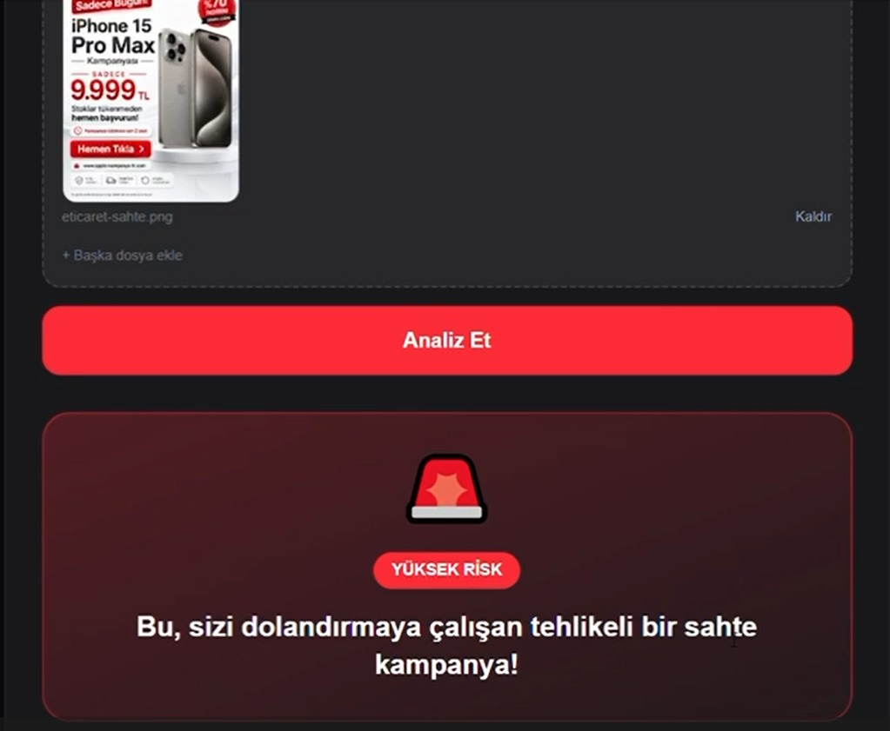
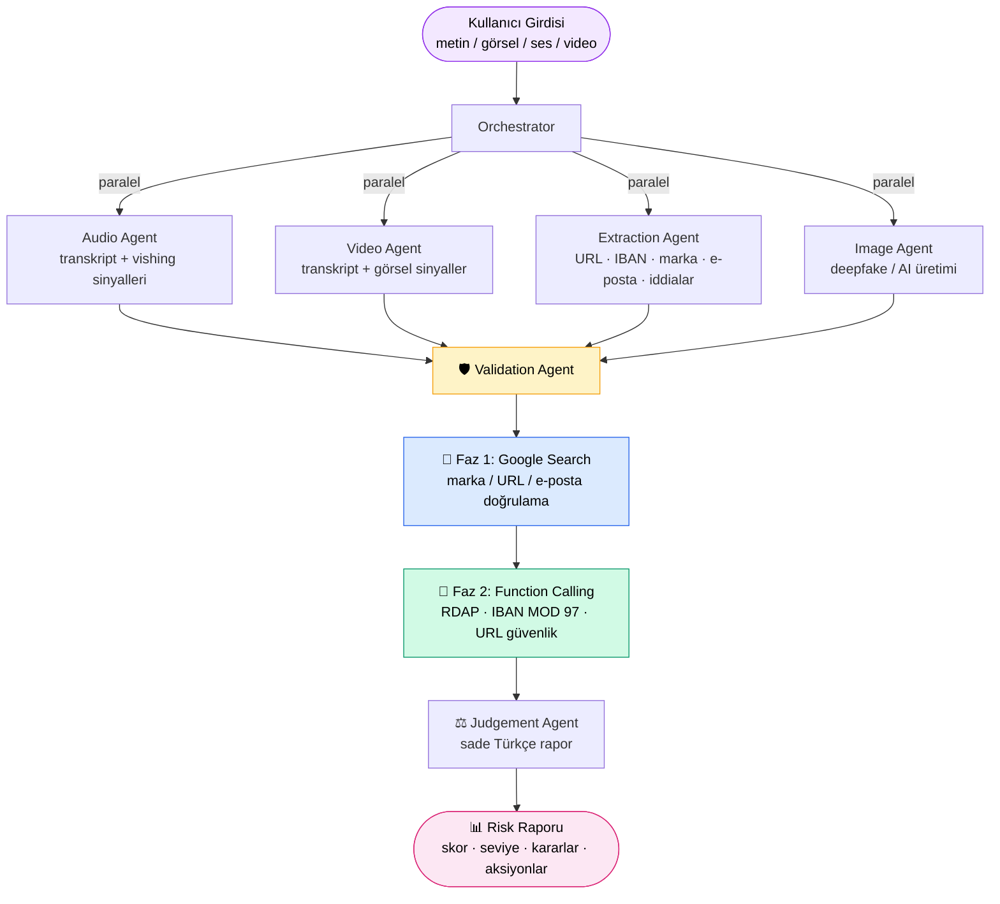
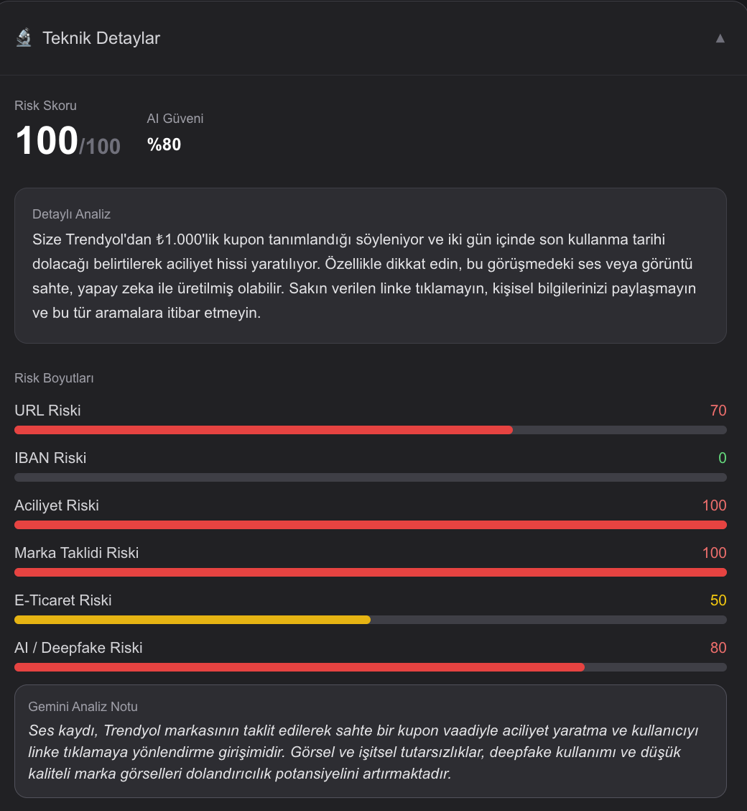
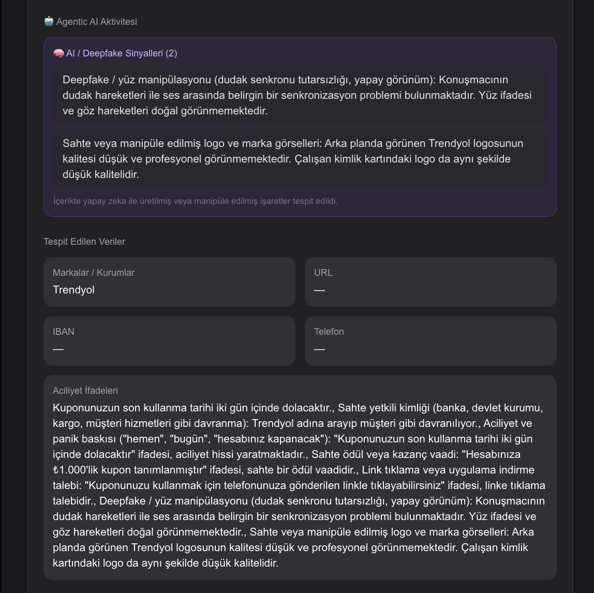
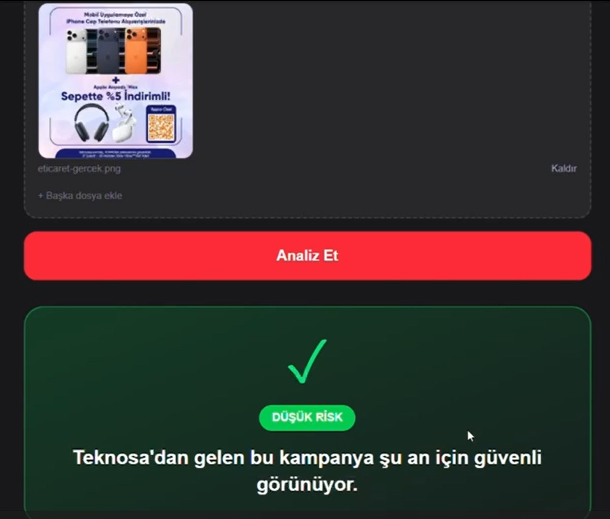

# ŞüpheKalkanı

> **BTK Akademi + Google Hackathon 2026** — Finans & E-Ticaret Kategorisi
>
> **Takım:** Şanslı &nbsp;·&nbsp; **Üyeler:** Arda AYDIN · Nursena ÖZKAN

ŞüpheKalkanı; şüpheli mesaj, e-posta, kampanya görseli, ses kaydı veya videoyu analiz ederek dolandırıcılık riskini tespit eden, **Gemini destekli agentic yapay zeka** tabanlı bir güvenlik asistanıdır.

Son yıllarda bu tür dolandırıcılıklar ciddi biçimde artmış, kullanıcılar için somut bir tehdit hâline gelmiştir. Ticaret Bakanlığı, Temmuz 2025'te sosyal medya üzerinden yapılan alışveriş dolandırıcılıkları ve yapay zekâ destekli yatırım aldatmacaları nedeniyle şikâyetlerdeki artışa karşı uyarıda bulundu. ABD'de ise 2025'te sosyal medyada başlayan dolandırıcılıklarda bildirilen kayıp *2,1 milyar dolara* ulaştı; 2025 internet suç raporu yaklaşık *21 milyar dolarlık* toplam kayba işaret etti. Bu tablo, sıradan bir kullanıcının şüpheli içeriği tek başına değerlendirmesini giderek zorlaştırıyor — ŞüpheKalkanı bu nedenle bir kolaylık değil, bir *gereksinimdir*.

Kullanıcı şüpheli bir içeriği yapıştırır ya da yükler; sistem saniyeler içinde sade ve anlaşılır bir risk raporu üretir: risk skoru, risk seviyesi, içeriğin neden şüpheli olduğu ve kullanıcının ne yapması gerektiği.

<p align="center">
  
</p>

## Problem

SMS, WhatsApp, e-posta, sahte kampanya görselleri, banka taklidi mesajlar ve sesli aramalar (vishing) yoluyla yapılan dolandırıcılık girişimleri hızla artmaktadır. Bu içeriklerde tipik risk sinyalleri şunlardır:

- Sahte veya marka taklidi bağlantılar
- Aciliyet ve panik baskısı
- IBAN veya ödeme yönlendirmesi
- Kimlik doğrulama / hesap kapatma bahanesi
- Gerçekçi olmayan fiyat, sahte indirim ve çekiliş vaatleri
- Yapay zeka ile üretilmiş (deepfake) görsel veya ses

Sıradan bir kullanıcı bu sinyalleri tek tek değerlendiremez. ŞüpheKalkanı bu değerlendirmeyi onun yerine yapar.

## Çözüm

Kullanıcı **metin, görsel, ses veya video** gönderir. İçerik, uzmanlaşmış ajanlardan oluşan bir agentic workflow ile analiz edilir ve şu çıktılar üretilir:

- Risk skoru (0–100)
- Risk seviyesi: LOW / MEDIUM / HIGH
- Tek cümlelik net karar (headline)
- Kırmızı bayraklar — içeriğin neden şüpheli olduğu
- Önerilen aksiyonlar — kullanıcının ne yapması gerektiği
- Risk boyutları: URL, IBAN, aciliyet, marka taklidi, e-ticaret, deepfake
- AI güven skoru

## Özellikler

- **Çok biçimli (multimodal) analiz** — metin, görsel, ses ve video.
- **Agentic mimari** — tek bir prompt yerine uzmanlaşmış ajan zinciri.
- **Google Search ile canlı doğrulama** — URL, marka ve e-posta adreslerinin resmi mi yoksa sahte mi olduğu gerçek zamanlı aramayla doğrulanır.
- **Function calling araçları** — domain tescil yaşı, IBAN matematiksel geçerliliği ve URL güvenlik analizi.
- **Görsel deepfake / AI üretimi tespiti** — yüklenen görselin yapay üretilmiş olup olmadığı değerlendirilir.
- **Sesli dolandırıcılık (vishing) tespiti** — ses ve video kayıtları transkribe edilip baskı / sahte yetkili kalıpları aranır.
- **E-ticaret dolandırıcılık sinyalleri** — gerçekçi olmayan fiyat, sahte indirim ve çekiliş tuzakları.
- **Yanlış pozitif koruması** — Google ile resmi olarak doğrulanan marka ve domainler yüksek risk almaz.
- **Sade dil** — yaşlı veya teknolojiden anlamayan kullanıcılar için teknik terim içermeyen, eylem odaklı rapor.

## Agentic Mimari

Projede tek bir prompt yerine uzmanlaşmış ajanlardan oluşan bir yapı kullanılmıştır.



### Orchestrator

Ajanları yönetir. Girdi türüne göre (metin, görsel, ses, video) ilgili ajanları çalıştırır, sonuçları birleştirir ve pipeline'ı sırayla ilerletir. Birbirinden bağımsız analizler (örneğin extraction ve görsel doğruluk analizi) paralel çalıştırılır.

### Extraction Agent

Gemini ile metni ve görseli analiz eder; içerikten URL, IBAN, telefon, marka/kurum adı, gönderici e-posta, iddialar, aciliyet ifadeleri, fiyat/çekiliş/indirim iddialarını ve kısa bir özeti çıkarır. Gemini bozuk yanıt verirse regex tabanlı fallback devreye girer.

### ImageAnalysisAgent

Yüklenen görseli, yapay zeka ile üretilmiş / deepfake olup olmadığı açısından değerlendirir; manipülasyon ve sahte arayüz/logo gibi görsel sinyalleri tespit eder.

### AudioAnalysisAgent / VideoAnalysisAgent

Ses ve video kayıtlarını transkribe eder; sesli dolandırıcılık (vishing) kalıplarını — baskı tonu, sahte yetkili kimliği, bilgi talebi — ve videolarda görsel dolandırıcılık sinyallerini tespit eder.

### Validation Agent

Çıkarılan verileri risk skorlarına dönüştürür. İki fazlı çalışır:

- **Faz 1 — Google Search doğrulaması:** İçerikteki URL, marka ve e-posta adreslerini canlı Google aramasıyla kontrol eder ve her biri için yapısal bir karar üretir: `official` / `spoof` / `unknown`.
- **Faz 2 — Function calling:** Gemini, güvenlik araçlarını çağırarak domain yaşı, IBAN geçerliliği ve URL güvenliğini analiz eder.

Ardından deterministik risk hesapları ile Gemini'nin değerlendirmesini birleştirir. **Search override:** Faz 1 bir domain veya e-postayı resmi olarak doğrularsa, sözlük tabanlı deterministik kontrollerin yarattığı yanlış pozitifler geri alınır — böylece gerçek kurumsal mesajlar yanlışlıkla riskli işaretlenmez.

### Judgement Agent

Validation sonucunu son rapora dönüştürür: final risk skoru, risk seviyesi, tek cümlelik karar, sade özet, kırmızı bayraklar, önerilen aksiyonlar ve güven skoru.

## Güvenlik Araçları (Function Calling)

Validation Agent, Gemini function calling ile aşağıdaki araçları çağırır:

| Araç | İşlevi |
|---|---|
| `check_domain_age` | Domainin RDAP üzerinden tescil yaşını öğrenir — çok yeni domainler yüksek risk taşır. |
| `check_iban_validity` | IBAN'ı ISO 7064 MOD 97-10 algoritmasıyla matematiksel olarak doğrular. |
| `check_url_safety` | URL'i şüpheli TLD, derin alt domain, IP adresi, kısaltma servisi gibi göstergelere göre analiz eder. |

## Risk Skorlama

Final risk skoru (0–100), altı risk boyutunun **ağırlıklı toplamı** + bağlama özel **kombinasyon bonusu** ile hesaplanır. Ağırlıklar içerik türüne göre değişir: ses transkriptinde URL görünmediği için aciliyet (urgency) baskın sinyaldir.

### Boyut ağırlıkları

| Boyut | Metin / Görsel / Video | Ses (vishing) |
|---|---|---|
| URL Riski | 0.18 | 0.18 |
| IBAN Riski | 0.22 | 0.22 |
| Aciliyet Riski | 0.10 | **0.35** |
| Marka Taklidi Riski | 0.22 | 0.15 |
| E-Ticaret Riski | 0.18 | — |
| AI / Deepfake Riski | 0.10 | 0.10 |

### Kombinasyon bonusları

Bazı sinyaller tek başlarına değil **birlikte göründüklerinde** dolandırıcılık ihtimalini katlar. Bu durumlarda ağırlıklı skora ek bonus eklenir:

| Kombinasyon | Bonus |
|---|---|
| E-ticaret riski ≥ 70 **+** URL riski > 30 (gerçekçi olmayan fiyat + şüpheli link) | +30 |
| Deepfake riski ≥ 60 **+** marka taklidi ≥ 40 (AI ile marka kılığına girme) | +30 |
| Marka taklidi ≥ 80 **+** URL var (klasik phishing) | +25 |
| Aciliyet > 40 **+** URL var (vishing — sesli dolandırıcılıkta link talebi) | +25 |
| IBAN riski > 50 **+** aciliyet > 30 (ödeme baskısı) | +20 |
| Deepfake riski ≥ 80 (tek başına çok güçlü AI sinyali) | +20 |
| E-ticaret riski ≥ 60 **+** aciliyet > 30 (sahte kampanya + panik) | +20 |
| URL riski > 70 **+** marka taklidi > 50 | +20 |
| URL riski > 70 **+** IBAN riski > 70 | +15 |
| Deepfake riski ≥ 45 (orta düzey AI şüphesi) | +10 |

Final skor `[0, 100]` aralığına klamplanır.

### Risk seviyesi eşikleri

| Skor | Seviye |
|---|---|
| 0 – 34 | **LOW** — güvenli görünüyor |
| 35 – 69 | **MEDIUM** — şüpheli işaretler var |
| 70 – 100 | **HIGH** — büyük olasılıkla dolandırıcılık |

### Hibrit yaklaşım

Her boyut iki kaynaktan gelir: **deterministik kurallar** (sözlük, regex, IBAN checksum, TLD listesi) ve **Gemini'nin bağlamsal değerlendirmesi**. İki skor `Math.max` ile birleştirilir — yani deterministik bir kural risk verdiyse, Gemini onu **düşüremez**. Tek istisna: Faz 1 Google Search'ün bir domaini **resmi olarak doğrulaması** durumunda heuristik (`marka + URL bir arada = 60`) skoru iptal edilir (yanlış pozitif koruması).

<p align="center">
  
  <br>
  <sub>Deepfake bir Trendyol müşteri hizmetleri videosu için risk boyutları: Aciliyet 100, Marka Taklidi 100, AI/Deepfake 80 — final skor 100/HIGH.</sub>
</p>

## Agentic Kanıtlar

ŞüpheKalkanı'nı bir LLM wrapper'dan ayıran şey, Gemini'nin analiz sırasında **otonom olarak araç çağırması ve canlı internet araması yapması**dır. Aşağıda gerçek bir analizde Gemini'nin ürettiği eylemler gösterilmiştir.

### Örnek 1 — Sahte e-ticaret kampanyası

Girdi (sahte kampanya görseli üzerinden):
```
Sadece Bugün! iPhone 15 Pro Max Kampanyası
SADECE 9.999 TL — Stoklar tükenmeden hemen başvurun!
%70 indirim · Hemen Tıkla
```

Gemini'nin **canlı Google aramaları** (Faz 1 — grounding):
```
→ "iPhone 15 Pro Max piyasa fiyatı"
→ "iPhone 15 Pro Max 9.999 TL kampanyası gerçek mi"
→ "Apple resmi satıcı kampanya"
```

Gemini'nin **çağırdığı araçlar** (Faz 2 — function calling):
```
→ check_url_safety({...})        # kampanya görselindeki link analiz edilir
→ check_domain_age({...})        # domain yaşı kontrol edilir
```

Sonuç: `finalScore: 99 / HIGH` — *"Bu, sizi dolandırmaya çalışan tehlikeli bir sahte kampanya!"* Piyasa fiyatının çok altında bir iPhone 15 Pro Max ilanı (gerçek piyasa fiyatı ~60.000–80.000 TL), yapay aciliyet ifadeleri ve abartılı indirim oranı bir araya gelerek çok yüksek risk skoruna ulaşıyor.

### Örnek 2 — Banka phishing'i

Girdi:
```
Ziraat Bankası hesabınız donduruldu! Hemen güncelleyin:
http://ziraatbank-giris.xyz IBAN: TR33 0006 1005 1978 6457 8413 26
```

Canlı Google araması:
```
→ "Ziraat Bankası resmi site"
```

Çağırdığı araçlar:
```
→ check_domain_age({"domain": "ziraatbank-giris.xyz"})
→ check_url_safety({"url": "http://ziraatbank-giris.xyz"})
→ check_iban_validity({"iban": "TR33 0006 1005 1978 6457 8413 26"})
```

Sonuç: `finalScore: 61 / MEDIUM` — sahte domain ve marka taklidi tespit ediliyor, ancak IBAN'ın matematiksel olarak geçerli çıkması (uydurulmuş değil) skoru "kesin tuzak" eşiğinin altında, "şüpheli — dikkatli ol" seviyesinde tutuyor. Kullanıcı yine net biçimde uyarılır.

### Örnek 3 — Gerçek banka bildirimi (yanlış pozitif testi)

Girdi (gerçek Yapı Kredi bilgilendirme SMS'i):
```
Hesabınıza tanımlanan bankacılık fırsatlarından ve Play kampanyalarından
faydalanabilirsin. Detaylı bilgi için: www.yapikrediplay.com.tr
Yapı Kredi Mobil'i İndir: yukle.yapikredi.com
SMS almamak için H yazın 4944'e gönder.
```

Faz 1 Google Search'ün ürettiği yapısal verdict:
```json
{
  "brandImpersonation": "legitimate",
  "urlVerdicts": [
    { "url": "www.yapikrediplay.com.tr", "verdict": "official",
      "note": "Yapı Kredi'nin resmi kampanya alanı" },
    { "url": "yukle.yapikredi.com", "verdict": "official",
      "note": "Yapı Kredi'nin resmi mobil uygulama indirme alanı" }
  ],
  "emailVerdicts": []
}
```

Bu doğrulama sayesinde, normalde *"marka + iki URL bir arada + indirme talebi"* heuristiğinin tetikleyeceği "marka taklidi şüphesi" **iptal edilir**. Sonuç: `finalScore: 4 / LOW` — *"Bu içerik şu an için güvenli görünüyor."* Yanlış pozitif kesin biçimde önlenmiş; gerçek banka bildirimleri rahat bırakılıyor.

### Agentic UI Paneli

Tüm bu kanıtlar arayüzde **Teknik Detaylar** sekmesinde gösterilir. Jüri ve teknik kullanıcı Gemini'nin attığı her adımı somut olarak görebilir.

<p align="center">
  
  <br>
  <sub>Agentic AI Aktivitesi paneli — Gemini'nin tespit ettiği deepfake sinyalleri, analiz notu ve çıkarılan veriler.</sub>
</p>

> Daha fazla örnek (deepfake video, bilinmeyen marka, sahte kampanya), tam JSON yanıtları ve sunucu logu için: **[docs/AGENTIC_PROOF.md](docs/AGENTIC_PROOF.md)**.
> Mimari iç işleyişi (risk formülü, agent dataflow, hata yönetimi, tasarım kararları) için: **[docs/ARCHITECTURE.md](docs/ARCHITECTURE.md)**.

## Kullanılan Teknolojiler

| Katman | Teknoloji |
|---|---|
| Frontend | Next.js 16, React 19, TypeScript, Tailwind CSS |
| Backend | Next.js Route Handlers (Node.js runtime) |
| Yapay Zeka | Google Gemini (`gemini-2.5-flash`) |
| SDK | `@google/genai` |
| Agentic yetenekler | Function calling, Google Search grounding, multimodal analiz |
| Şema doğrulama | Zod |
| Rate limit | In-memory |

## Proje Yapısı

```txt
src/
  app/
    api/analyze/route.ts        analiz API endpoint'i
    page.tsx                    kullanıcı arayüzü
  lib/
    agents/
      orchestrator.ts           ajan akışını yönetir
      extractionAgent.ts        içerikten veri çıkarımı
      imageAnalysisAgent.ts     görsel deepfake / AI analizi
      audioAnalysisAgent.ts     ses analizi
      videoAnalysisAgent.ts     video analizi
      validationAgent.ts        risk skoru + Google Search doğrulama
      judgementAgent.ts         final rapor
    gemini/client.ts            Gemini API + çoklu key rotasyonu
    tools/securityTools.ts      domain / IBAN / URL araçları
    utils/riskHelpers.ts        deterministik risk hesapları
    schemas/reportSchema.ts     Zod şemaları
demo/                           hazır örnek senaryo dosyaları
```

## Kurulum

Projeyi klonlayın:

```bash
git clone https://github.com/ArdaAyd/suphe-kalkani.git
cd suphe-kalkani
```

Bağımlılıkları kurun:

```bash
npm install
```

Proje kök dizininde `.env.local` dosyası oluşturun:

```env
GEMINI_API_KEY=buraya_gemini_api_key
```

Projeyi çalıştırın:

```bash
npm run dev
```

Tarayıcıda açın: `http://localhost:3000`

## Ortam Değişkenleri

| Değişken | Zorunlu | Açıklama |
|---|---|---|
| `GEMINI_API_KEY` | Evet | Google AI Studio'dan alınan Gemini API anahtarı. |
| `GEMINI_API_KEY_2` … `GEMINI_API_KEY_10` | Hayır | Ek API anahtarları. Bir anahtar kota dolduğunda (429) sistem otomatik olarak sıradakine geçer. |

API anahtarları yalnızca `.env.local` içinde tutulmalıdır; bu dosya `.gitignore` ile hariç tutulmuştur ve sürüm kontrolüne gönderilmemelidir.

## API Endpoint

### POST `/api/analyze`

Metin, görsel, ses ve/veya videoyu analiz eder.

`multipart/form-data` alanları:

| Alan | Tür | Açıklama |
|---|---|---|
| `input` | metin | Analiz edilecek metin (opsiyonel) |
| `file` | görsel | Görsel dosyası (opsiyonel) |
| `audio` | ses | Ses dosyası (opsiyonel) |
| `video` | video | Video dosyası (opsiyonel) |

Yalnızca metin için `application/json` ile `{ "input": "..." }` gövdesi de gönderilebilir.

Örnek tam yanıt (üç ana blok — `extraction`, `validation`, `report` — ve girdi türüne göre opsiyonel `audio` / `video` blokları):

```json
{
  "extraction": {
    "textSummary": "Ziraat Bankası adıyla gönderilmiş, hesap dondurma uyarısı içeren ve şüpheli bir bağlantıya yönlendiren bir mesaj.",
    "urls": ["http://ziraatbank-giris.xyz"],
    "ibans": ["TR33 0006 1005 1978 6457 8413 26"],
    "phones": [],
    "brandNames": ["Ziraat Bankası"],
    "senderEmails": [],
    "claims": ["Hesabınız donduruldu"],
    "urgencyPhrases": ["Hemen güncelleyin"],
    "priceClaims": [],
    "giveawayPhrases": [],
    "discountClaims": []
  },
  "validation": {
    "urlRisk": 80,
    "ibanRisk": 75,
    "urgencyRisk": 40,
    "brandSpoofRisk": 100,
    "ecommerceRisk": 0,
    "deepfakeRisk": 0,
    "deepfakeSignals": [],
    "redFlags": [
      "Şüpheli üst düzey domain uzantısı (.xyz)",
      "Domain adında tire (-) karakteri",
      "Şifresiz HTTP bağlantısı",
      "URL'nin Ziraat Bankası'nın resmi domaini olmaması",
      "IBAN paylaşımı içeriyor — doğrudan ödeme talebi."
    ],
    "reasoning": "URL analizi sonucunda şüpheli domain uzantısı, tire karakteri ve HTTP kullanımı yüksek risk oluşturmaktadır. Ziraat Bankası'nın resmi domain'i ziraatbank.com.tr olmasına rağmen mesajdaki URL ziraatbank-giris.xyz şeklinde sahte bir adrestir.",
    "webSearchQueries": ["Ziraat Bankası resmi site"],
    "toolCalls": [
      "check_domain_age({\"domain\":\"ziraatbank-giris.xyz\"})",
      "check_url_safety({\"url\":\"http://ziraatbank-giris.xyz\"})",
      "check_iban_validity({\"iban\":\"TR33 0006 1005 1978 6457 8413 26\"})"
    ]
  },
  "report": {
    "finalScore": 100,
    "riskLevel": "HIGH",
    "headline": "Bu mesaj büyük olasılıkla paranızı çalmaya çalışan bir tuzak.",
    "summary": "Size Ziraat Bankası'ndan geldiği iddia edilen mesaj sahte bir adrese yönlendiriyor. Bilgileriniz çalınmak isteniyor.",
    "redFlags": ["Şüpheli üst düzey domain uzantısı (.xyz)", "..."],
    "recommendedActions": [
      "Bu bağlantıya tıklamayın.",
      "Ziraat Bankası işlemleriniz için sadece ziraatbank.com.tr adresini kullanın.",
      "Bu mesajı bankanın dolandırıcılık bildirim hattına iletin."
    ],
    "confidence": 95
  }
}
```

**Validation bloğundaki agentic alanlar:**

| Alan | İçerik |
|---|---|
| `webSearchQueries` | Faz 1'de Gemini'nin canlı yaptığı Google arama sorguları |
| `toolCalls` | Faz 2'de Gemini'nin çağırdığı güvenlik araçları (argümanlarla birlikte) |
| `deepfakeSignals` | Görsel/ses analizinden çıkan deepfake/AI üretimi sinyalleri |
| `reasoning` | Gemini'nin nihai değerlendirme metni |

**Hata yanıtları:**

| HTTP | Anlamı |
|---|---|
| 400 | Analiz edilecek içerik gönderilmedi. |
| 429 | Aynı IP'den dakikada en fazla 5 analiz sınırı aşıldı. |
| 503 | Yapay zeka servisine ulaşılamadı (tüm API anahtarları doldu veya model yanıt vermedi). Sahte güvenli sonuç üretmek yerine açık hata döner. |
| 500 | Beklenmedik sunucu hatası. |

## Demo Senaryoları

`demo/` klasöründe ürünü hızlıca denemek için hazır örnek dosyalar bulunur — sahte ve gerçek banka / e-ticaret içerikleri (görsel ve video). `gerçek` örnekler, aracın meşru kurumsal mesajlarda yanlış pozitif vermediğini doğrular. Ayrıntılar `demo/README.md` içindedir.

### Senaryo Matrisi

Geliştirme sırasında manuel olarak test edilen senaryolar. Her satır farklı bir dolandırıcılık tipini veya yanlış pozitif testini temsil eder. Skorlar Gemini'nin sürümüne ve canlı Google sonuçlarına bağlı olarak ufak farklarla değişebilir.

| Kategori | Senaryo | Beklenen | Gerçekleşen | Sonuç |
|---|---|---|---|---|
| Banka phishing | Sahte Ziraat link + IBAN | MEDIUM | 61 / MEDIUM | ✅ |
| Sahte e-ticaret kampanyası | iPhone 15 Pro 9.999 TL | HIGH | 99 / HIGH | ✅ |
| Sahte e-posta gönderici | `kampanya@amaz0n-destek-mail.com` | HIGH | 89 / HIGH | ✅ |
| Bilinmeyen marka taklidi | Hopi puanlarınız + .xyz link | HIGH | 70 / HIGH | ✅ |
| Vishing (ses kaydı) | Sahte banka müşteri hizmetleri | HIGH | 78 / HIGH | ✅ |
| Deepfake video | AI üretilmiş müşteri temsilcisi | HIGH | 85 / HIGH | ✅ |
| **Yanlış pozitif testi** | Gerçek banka bildirimi | LOW | 4 / LOW | ✅ |
| **Yanlış pozitif testi** | Gerçek Teknosa kampanya reklamı | LOW | 13 / LOW | ✅ |
| **Yanlış pozitif testi** | Düz "test mesajı" | LOW | < 20 / LOW | ✅ |

**Yanlış pozitif testleri** kasıtlı eklenmiştir: bir dolandırıcılık tespit aracının asıl değeri sadece **yakalayabilmek** değil, **meşru mesajları rahat bırakabilmek**tir. Gerçek Trendyol bildirim e-postasını veya PTT kargo mesajını yanlışlıkla HIGH işaretleyen sistem kısa sürede kullanışsız hale gelir.

<table>
  <tr>
    <td align="center" width="50%">
      <br>
      <sub><b>Sahte kampanya</b> — iPhone 15 Pro Max 9.999 TL → <b>YÜKSEK RİSK</b></sub>
    </td>
    <td align="center" width="50%">
      <br>
      <sub><b>Gerçek kampanya</b> — Teknosa indirim → <b>DÜŞÜK RİSK</b> (yanlış pozitif önlendi)</sub>
    </td>
  </tr>
</table>

### Metin Tabanlı Hızlı Örnekler

| İçerik | Beklenen sonuç |
|---|---|
| `Merhaba, bu sadece bir test mesajıdır.` | LOW |
| `Trendyol indirim kuponunuz hazır. http://bit.ly/firsat-link adresine tıklayın.` | MEDIUM |
| `PTT kargonuz beklemede. http://bit.ly/sahte-link adresinden ödeme yapın. IBAN TR12...` | HIGH |

## Sınırlamalar

ŞüpheKalkanı dolandırıcılık tespitinde güçlü sinyaller verir; ancak şu anki haliyle bazı sınırları vardır. Bunları açıkça paylaşıyoruz çünkü kullanıcının sistemin kapsamını ve kapasitesini bilmesi önemlidir.

- **Yerel marka odaklılığı.** Bilinen marka sözlüğü ağırlıklı olarak Türkiye pazarındaki bankalar, e-ticaret siteleri, kargo, market ve devlet kurumlarını kapsar. Bu sözlükte olmayan markalar için Gemini canlı Google araması yapar — yine de uluslararası niş markalarda tespit kalitesi yerel markalara göre daha düşüktür.
- **Ses ve video boyutu sınırı.** Ses ve video dosyaları analiz için Gemini'ye inline olarak gönderilir; dosya başına ~15 MB sınırı vardır. Daha büyük dosyaların önce kırpılması veya sıkıştırılması gerekir.
- **Deepfake tespitinin karakteristiği.** AI ile üretilmiş video tespiti, görüntü kalitesi ve aydınlatma koşullarına duyarlıdır. Düşük ışıkta çekilmiş gerçek videolarda nadiren "yapay görünüm" şüphesi raporlanabilir (yanlış pozitif); yüksek kaliteli yeni nesil deepfake'lerde sinyal zayıflayabilir (yanlış negatif).
- **Path tabanlı marka enjeksiyonu.** Hostname'de değil de URL yolunda marka adı geçen kalıplar (örn: `attacker.xyz/ziraatbank.com.tr/login`) marka taklidi olarak işaretlenmez. Bu örüntü, hostname'i öne çıkardığı için tarayıcı adres çubuğunda da kolayca fark edilir; gerçek dolandırıcılıkta ana risk değildir, fakat sistemin bir kör noktasıdır.
- **Sesli transkript kalitesi.** Vishing tespiti Gemini'nin transkripsiyon çıktısına dayanır; gürültülü kayıtlarda, ağır aksanda veya birden çok konuşmacının iç içe geçtiği seslerde transkript kalitesi düşebilir ve risk skoru altında kalabilir.
- **Tek seferlik analiz.** Sonuçlar saklanmaz; aynı içeriği iki kez gönderdiğinizde sistem her seferinde yeniden çalışır (cache yok). Aynı IBAN/URL'nin sürekli aynı kullanıcıyla görünmesi gibi zaman serisi kalıpları izlenmez.
- **Bilinen tehdit veritabanı entegrasyonu yok.** Google Safe Browsing, VirusTotal gibi raporlanmış zararlı URL veritabanlarına bağlı değildir. Bu, bilinmeyen yeni dolandırıcılık sitelerinde fark yaratan tercihtir: heuristik + canlı Google araması, henüz raporlanmamış dolandırıcılıkları da yakalayabilir. Ek bir veri kaynağı ileride entegre edilebilir.
- **Free tier API kotası.** Geliştirme ortamında ücretsiz Gemini API anahtarı kullanıldığında her anahtarın günlük çağrı sınırı vardır. Çoklu anahtar rotasyonu bu sınırı esnetir, ancak yüksek hacimli kullanım için ücretli plan gerekir.
- **Tek dil odaklı raporlama.** Tüm risk raporları Türkçe üretilir. Diğer dillerde gönderilen içerik analiz edilebilir, ancak son rapor yine Türkçedir.

## Dayanıklılık ve Güvenlik

- **Rate limit** — bir IP için dakikada en fazla 5 analiz isteği.
- **Çoklu API anahtarı rotasyonu** — bir anahtar 429 (kota) hatası aldığında otomatik olarak sıradaki anahtara geçilir.
- **503 yeniden deneme** — model anlık olarak aşırı yüklendiğinde artan beklemeyle tekrar denenir.
- **Dürüst hata yönetimi** — yapay zeka servisine hiç ulaşılamadığında sistem sahte bir "güvenli" sonuç üretmez; kullanıcıya açıkça "analiz yapılamadı" uyarısı gösterir.
- **Fallback** — Gemini bozuk yanıt verdiğinde (servis erişilebilirken) deterministik analiz devreye girer.
- **Yüklenen dosyalar** geçici olarak işlenir ve analiz sonrası silinir; API anahtarları yalnızca ortam değişkeninde tutulur.

## Takım

**Takım: Şanslı**

- **Arda AYDIN**
- **Nursena ÖZKAN**

BTK Akademi + Google Hackathon 2026 — Finans & E-Ticaret kategorisi için hazırlanmıştır.

## Lisans

Bu proje [MIT Lisansı](LICENSE) altında lisanslanmıştır. Kodu serbestçe kullanabilir, değiştirebilir ve dağıtabilirsiniz; tek koşul lisans metnini ve telif notunu kopyanızda korumanızdır.
